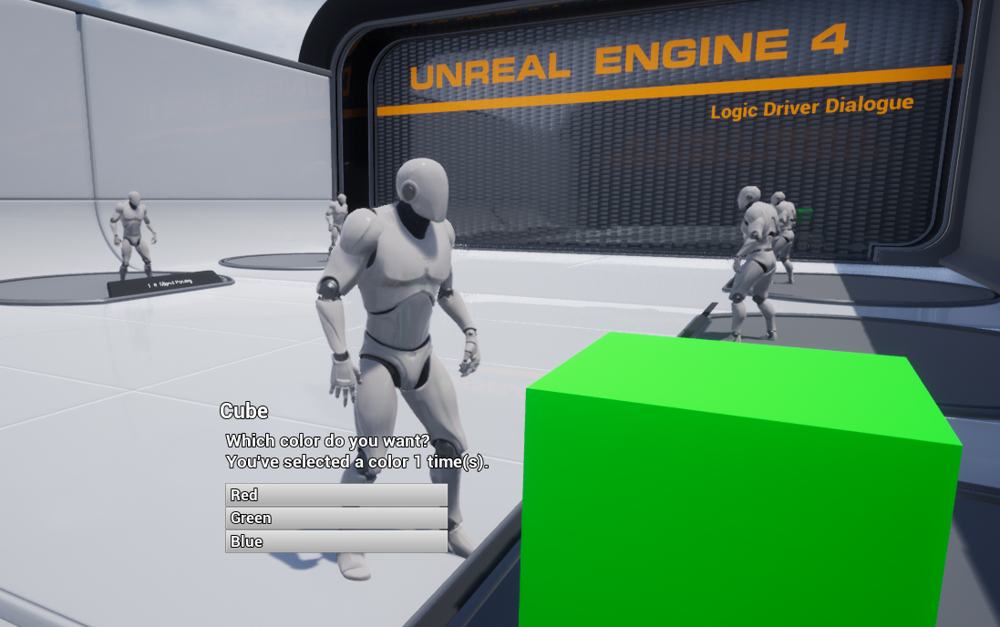

# Logic Driver Pro Blueprint Dialogue Example Project
**Requires Logic Driver Pro 2.5+**

Blueprint only implementation of a dialogue system using Logic Driver.

Adds Dialogue Nodes, Choice Nodes, and Dialogue Transitions.
Includes behavior to autoplace dialogue transitions and limit choices to dialogue nodes.

Dialogue nodes support loading text from data tables through the details panel.

Logic Driver Dialogue Component can be added to any actor which should speak.
Logic Driver Dialogue Manager component should be used as a singleton. In this template it's expected to be on the game mode.

### Files Layout

- Template folder contains base files for use in your project.
- Samples folder contains example implementations and an example map.

---

